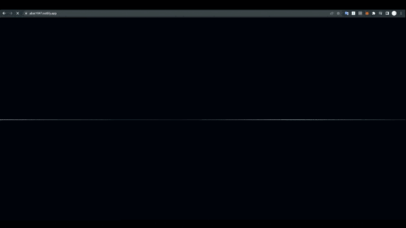

# project_my_website

다른 언어도 배우고 싶어서 대충 html이랑 css랑 java script 배우면서 5일동안 뚝딱 만든거

처음 배운거인데 독학으로 배우는거라 코드가 엉망진창임

만들다가 재밌어서 심심할때마다 계속 이것저것 추가중

 

### 2022-12-23 추가

코드가 개판이라 유지 보수가 힘들어서 <a href = "https://github.com/ABER1047/Project_aboutme/tree/main">새로 리메이크</a> 했음

 

### ▼ 미리보기

#

### ▼ 웹사이트 :

(메인)

https://aber1047.github.io/project_my_website/

(미러링)

https://aber1047.netlify.app/
